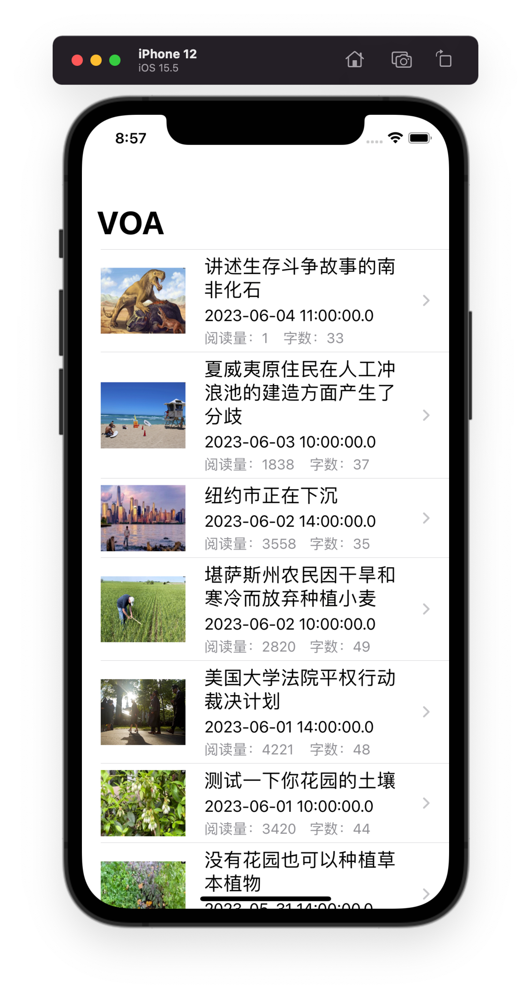
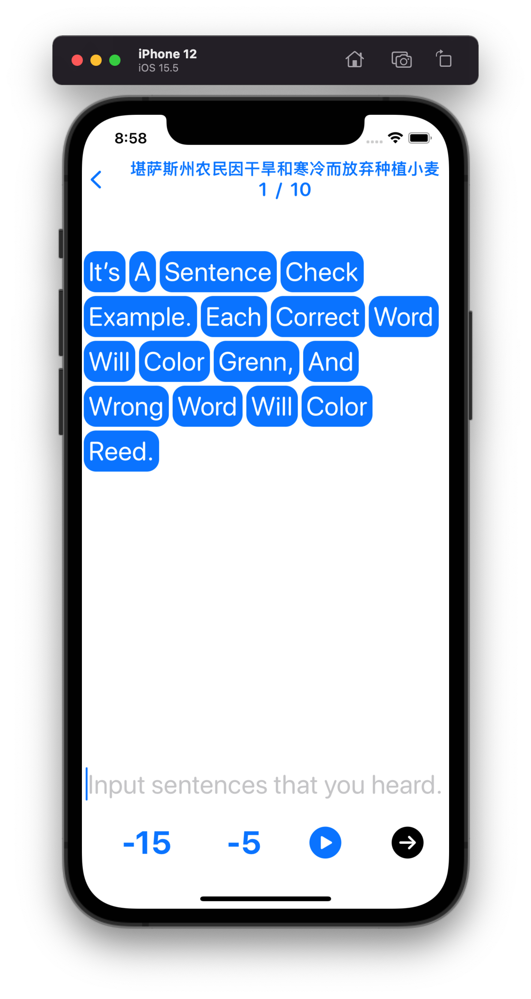
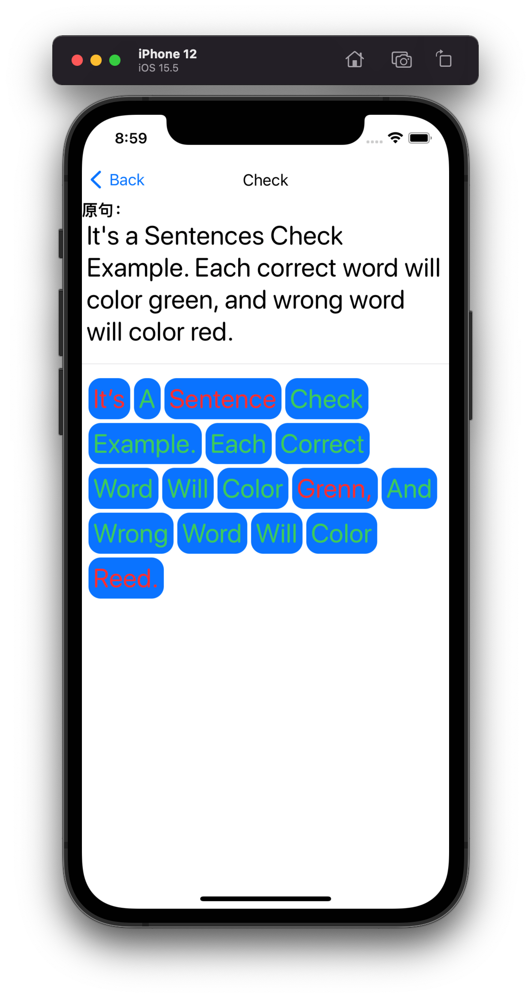

# SentenceCheckAPP
精听来练习听力，使用多邻国类似界面设计，对输入的句子进行单词级别比较，听力时可以回溯5s或者15s。

## 首页
首页展示每个听力材料，包括其标题、发布时间和阅读量。

## 听力
听力页面展示用户听力输入的字词，下面有暂停/继续播放按钮，以及精听的回溯

## 检查
检查页面对比用户听力所输入的字词与答案的字词之间的区别，用具体的颜色来标注

## To be continue